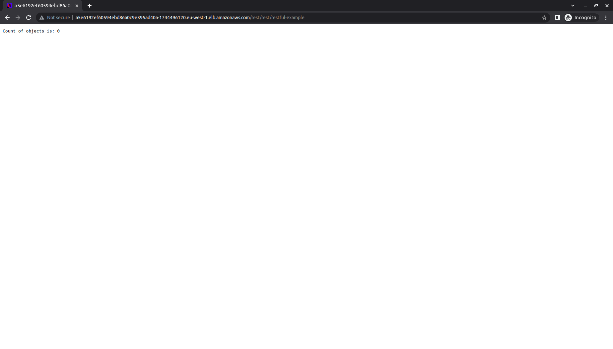

# lab-northbound-k8s-ingress

## Lab Goals

Demonstrate how to deploy a GigaSpaces service and expose it through a Kubernetes Ingress

## Lab Description
This lab contains the following steps which may be broken down into additional steps.

 * K8s cluster already spun up 
 * Deploy ingress controller
 * Deploy services 
 * Apply ingress yaml
 * Verify


## 1 Lab setup
1. Install [Maven](https://maven.apache.org/install.html).

##### Note - Maven

Maven versions &gt; 3.8 won't connect to non-https repos by default. Below is a workaround.

In ~/.m2/settings.xml, (if it doesn't exist, copy it from &lt;maven install directory&gt;/conf/settings.xml)

Add:
```xml
<mirror>
  <id>maven-default-http-blocker</id>
  <mirrorOf>external:http:*</mirrorOf>
  <name>Pseudo repository to mirror external repositories intially using HTTP.</name>
  <url>http://maven-repository.openspaces.org</url>
</mirror>
```
(There is already a section mirror. Modify the url and and comment out or remove blocked=true)

2. Refer to the [OOTB-DIH-k8s-provisioning](https://github.com/GigaSpaces-ProfessionalServices/OOTB-DIH-k8s-provisioning) for k8s cluster setup instructions.

3. Run the `./install-dih-umbrella.sh` only. This will create the GigaSpaces Manager and the Operator.

## 2 Package artifacts

1. Assuming this lab folder has already been downloaded, `cd dih-k8s-training-labs/lab-northbound-k8s-ingress` and run `mvn package`:

```
~/dih-k8s-training-labs/lab-northbound-k8s-ingress$ mvn package

...
[INFO] ------------------------------------------------------------------------
[INFO] Reactor Summary for restexample 1.0-SNAPSHOT:
[INFO] 
[INFO] restexample ........................................ SUCCESS [  0.002 s]
[INFO] restservice ........................................ SUCCESS [  2.045 s]
[INFO] space .............................................. SUCCESS [  0.792 s]
[INFO] dist ............................................... SUCCESS [  0.203 s]
[INFO] ------------------------------------------------------------------------
[INFO] BUILD SUCCESS
[INFO] ------------------------------------------------------------------------
[INFO] Total time:  3.124 s
[INFO] Finished at: 2023-01-24T12:21:44-05:00
[INFO] ------------------------------------------------------------------------
```

## 3 Host artifacts

For the purpose of this lab, I have created a folder `gstm376-dixson` in an existing s3 bucket and uploaded the jar files to it. For lab purposes, the jars are publicly accessible. There are two artifacts needed:

```
dih-k8s-training-labs/lab-northbound-k8s-ingress/space/target/demo-pu.jar
dih-k8s-training-labs/lab-northbound-k8s-ingress/dist/target/restservice.jar
```

## 4 Install ingress controller

Assuming helm is already installed,

1. Add the helm repo
```
helm repo add nginx-stable https://helm.nginx.com/stable
```
2. Refresh the repo to get the latest updates
```
helm repo update
```
3. Install the ingress controller
```
helm install my-nginx nginx-stable/nginx-ingress --set rbac.create=true
```

**Important** - Immediately after the ingress controller is installed (but after the service has been created) run:

```
# Replace attendee with your first name and run the below command.  
kubectl patch svc my-nginx-nginx-ingress -p '{"metadata":{"annotations":{"service.beta.kubernetes.io/aws-load-balancer-additional-resource-tags":"Owner=attendee,Project=gstm376-attendee,Name=ingress"}}}'

# To verify these values have been applied
kubectl describe svc my-nginx-nginx-ingress

# To verify nginx helm installation run: kubectl get pods; kubectl get service; kubectl get deployment; kubectl get replicaset
# Or run:
kubectl get all

```

This is needed to help manage resources and to work with our internal audit policies.

## 5 Install space

```
helm install demo gigaspaces/xap-pu --version 16.2.1 --set manager.name=xap --set schema=partitioned,partitions=1,resourceUrl=https://csm-training.s3.eu-west-1.amazonaws.com/gstm376-dixson/demo-pu.jar,properties=space.name=demo
```

## 6 Install web PU
In this step we will deploy a web Processing Unit which is a rest service that can access the space.

```
# Replace the resourceUrl with the location of your web PU artifact
helm install rest gigaspaces/xap-pu --version 16.2.1 --set manager.name=xap --set instances=1,resourceUrl=https://csm-training.s3.eu-west-1.amazonaws.com/gstm376-dixson/restservice.jar,properties=web.port=8091,metrics.enabled=false,livenessProbe.enabled=false,readinessProbe.enabled=false
```

## 7 Verification

1. Below are basic verification to confirm the helm deployments worked.
```
# To verify run: kubectl get pods; kubectl get service; kubectl get statefulset; kubectl get pus
# Or run: kubectl get all
# then run
$ kubectl get pus
kubectl get pus
NAME   STATUS
demo   DEPLOYED
rest   DEPLOYED
```

2. If the deployment was not successful, you can try the following:

 * If the pod gets deployed, but restarts
```
kubectl logs <pod name>
# Or
kubectl logs <pod name> --previous
# Or
kubectl describe <pod name>   
```
 * If the pod never gets started and pus status is `PRE_DEPLOYMENT`, check the operator pod logs
```
kubectl logs <pod/xap-operator-name>
# for example
kubectl logs xap-operator-54c7d9785-7975k
```

## 8 Expose the service

In the `dih-k8s-training-labs/lab-northbound-k8s-ingress/yaml` directory there is a yaml `pu-service.yaml`. Change to this directory and run:

```
kubectl apply -f pu-service.yaml
```

## 8 Define and deploy the ingress resource

1. Modify the host value in ingress.yaml

 * Check the external-ip given by load nginx service
```
[centos@ip-172-31-24-138 ~]$ kubectl get service
NAME                      TYPE           CLUSTER-IP       EXTERNAL-IP                                                               PORT(S)
demospace-hs              ClusterIP      None             <none>                                                                    <none>
demospace-xap-pu-hs       ClusterIP      None             <none>                                                                    <none>
grafana-lb                LoadBalancer   172.20.198.233   a0f9fa770bb624545aac601897cae40a-920489994.eu-west-1.elb.amazonaws.com    3000:30974/TCP
kubernetes                ClusterIP      172.20.0.1       <none>                                                                    443/TCP
manager-loadbalancer      LoadBalancer   172.20.145.53    a3757173d66a949ba9cab9f1fde02e14-1745997678.eu-west-1.elb.amazonaws.com   8200:31232/TCP,4174:31448/TCP,8090:32388/TCP
my-nginx-nginx-ingress    LoadBalancer   172.20.234.34    a5e6192ef60594ebd86a0c9e395ad40a-1744496120.eu-west-1.elb.amazonaws.com   80:31332/TCP,443:31166/TCP
pu-service                ClusterIP      172.20.97.69     <none>                                                                    8091/TCP
rest-hs                   ClusterIP      None             <none>                                                                    <none>
rest-xap-pu-hs            ClusterIP      None             <none>                                                                    <none>
webhook-server            ClusterIP      172.20.80.47     <none>                                                                    443/TCP
xap-grafana               ClusterIP      172.20.76.186    <none>                                                                    3000/TCP
xap-influxdb              ClusterIP      172.20.221.35    <none>                                                                    8086/TCP,8088/TCP
xap-xap-manager-hs        ClusterIP      None             <none>                                                                    2181/TCP,2888/TCP,3888/TCP,4174/TCP
xap-xap-manager-service   LoadBalancer   172.20.63.145    adf2d83acb7bd439093da78d3650c903-434495312.eu-west-1.elb.amazonaws.com    8090:31309/TCP,4174:32628/TCP,8200:31208/TCP
```
 * In the ingress.yaml, modify the host value with the External-IP that was assigned during the Ingress Controller deployment

2. Deploy the ingress
```
kubectl apply -f ingress.yaml
```
3. Verify ingress
```
[centos@ip-172-31-24-138 ~]$ kubectl get ingress
NAME              CLASS   HOSTS                                                                     ADDRESS                                                                   PORTS
example-ingress   nginx   a5e6192ef60594ebd86a0c9e395ad40a-1744496120.eu-west-1.elb.amazonaws.com   a5e6192ef60594ebd86a0c9e395ad40a-1744496120.eu-west-1.elb.amazonaws.com   80   
```

## 9 Verify

In a web browser go to the EXTERNAL-IP that is exposed in the ingress controller (and also specified in the ingress.yaml).


```
http://<host name provisioned by eks>/rest <- Hello World!
http://<host name provisioned by eks>/rest/rest/restful-example <- Shows the count of objects in the demo space.
```

