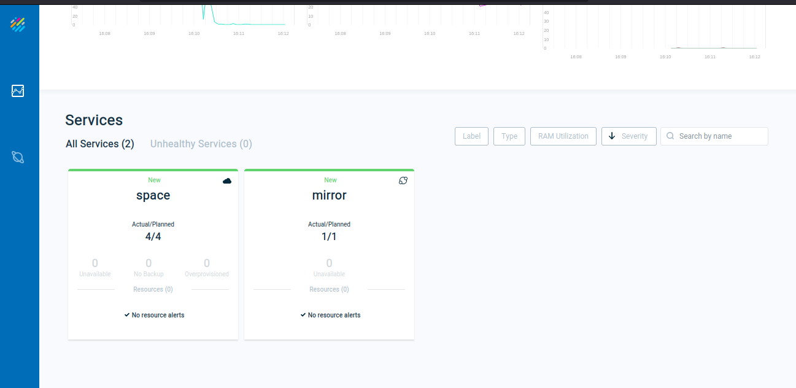
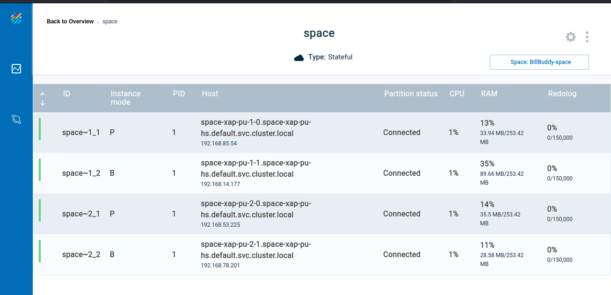

# Smart-DIH-K8s-training - lab-solution

## 	Persistency – Mirror Service

###### Lab Goals
1.  Understand the tasks involved in implementing a mirror service.
2.  implement a mirror service.
###### Lab Description
This lab includes 1 solution in which we will perform the tasks required to implement a mirror service. 
Use the slides from the lesson as a reference.
## 1 Lab setup
Make sure you EKS cluster created and Kubectl+helm are installed and configure to connect to Eks

1.1 Open %XAP_TRAINING_HOME%/K8s-training-lab-solution project with intellij (open pom.xml) 
1.2 Run mvn install

    ~/xap-dev-training/xap-dev-training-lab17-solution$ mvn install
    
    [INFO] ------------------------------------------------------------------------
    [INFO] Reactor Summary:
    [INFO] 
    [INFO] Lab17-solution 1.0-SNAPSHOT ........................ SUCCESS [  0.994 s]
    [INFO] BillBuddyModel ..................................... SUCCESS [  5.310 s]
    [INFO] BillBuddy_Space .................................... SUCCESS [  1.187 s]
    [INFO] BillBuddyAccountFeeder ............................. SUCCESS [  1.401 s]
    [INFO] BillBuddyPaymentFeeder 1.0-SNAPSHOT ................ SUCCESS [  1.293 s]
    [INFO] ------------------------------------------------------------------------
    [INFO] BUILD SUCCESS

    
## 2	Persistency – Mirror Service Implementation
#### 2.1	Setup MySQL RDS for this lesson.  

    https://aws.amazon.com/getting-started/hands-on/create-mysql-db/

a.	Connect to Mysql InstanceRun the mysql server: 

    mysql -u<username> -h<RDS_endpoint> -p  [Enter master user password after hit Enter]     
b.	Create BillBuddy database:

    mysql> create database jbillbuddy;

#### 2.2	Configure your space to be mirror service aware.  .
a.	Modify your embedded Space Pu.xml. mirrored="true" space element tag (Hint: BillBuddy_space pu.xml)  
#### 2.3	Map the data model to tables (using Hibernate. we will use annotations.)  
a.	Search the data model to see which POJOs were chosen for persistency for our demo  
b.	Examine specifically the User and Address relationship and try to figure out the meaning of the hibernate annotations.  
#### 2.4	Configure the mirror service.  
The mirror service requires having to be configured appropriately. 
The lab is already configured correctly for you. 
Your task is to locate the file in which the configuration is defined.
Basically you should be able to answer the following questions prior to configuring the environment.   
a.	What space am I Mirroring?  
Answer: BillBuddy-space  
b.	Which POJOs am I to persist?  
Answer: In this lab we will persist: User, Merchant, Payment, ProcessingFee and Contract
Package Name: com.gs.billbuddy.model  
c.	What is the database (in most cases) that I am persisting to?   
Answer: we will use MySQL DB for demo purposes.  		
d.	What are the DB user name, DB password, JDBC URL and JDBC Driver?  
Answer: 

#### 2.5	The following tasks will make it clearer how to implement a Mirror service.  
Hint: Use slides from the lesson as a reference. Most tasks are already implemented.  
a.	Expand BillBuddyPersisitency and open the pu.xml file.  
b.	Locate the data source bean (DB Connection properties). 
Write down the user and the password for the MySQL DB database 
(You will use it later).  
c.	Specify Space Components to be mapped using package scanning. 

Configure spring to locate your hibernate annotated classes.  
1.	Fill in the package to be scanned where your persistent 
POJOs are located 
(Search the POJOs in the model that were annotated with @Entity and write their full name in the SessionFactory bean). 
<property name="packagesToScan" value="com.gs.billbuddy.model" />
2.	Hint: 4 classes only for this demo (but all in same package)
d.	Specify the mirror to recognize the mirror space (This step is already implemented)
1.	Complete the os-core:mirror -> os-core:source-space
2.	Use slides from the lesson as a reference.  

#### 2.6	Make sure you have a Database ready for use.
We will using MySQL db instance.  
a.	Make sure you have the MySQL instance up and running (see section 13.1.1 (e) )

#### 2.7	Jar the BillBuddyPersistency project. Make sure to include the BillBuddyModel in the Jar.  
#### 2.8	Deploy and test the Mirror service (and your space).  
 
a.	Install Manager  
    `helm install manager gigaspaces/xap-manager --version 16.0`

b.	Copy BillBuddy_space and  BillBuddPersistency jar to AWS S3 
  `aws s3 cp --acl public-read-write xap-dev-training-lab17-solution/BillBuddy_Space/target/BillBuddy_Space.jar s3://aa-nihar-test/dih-training/`
    
   `aws s3 cp --acl public-read-write xap-dev-training-lab17-solution/BillBuddPersistency/target/BillBuddPersistency.jar s3://aa-nihar-test/dih-training/`

c.	Deploy BillBuddy_space to the service grid.  
    `helm install space gigaspaces/xap-pu --version 16.0 --set manager.name=manager,resourceUrl="https://aa-nihar-test.s3.us-east-2.amazonaws.com/dih-training/BillBuddy_Space.jar",partitions=2,ha=true`

d.	Deploy BillBuddPersistency to the service grid (Remember to include BillBuddy model Project. See below)  
    `helm install mirror gigaspaces/xap-pu --version 16.0 --set manager.name=manager,resourceUrl="https://aa-nihar-test.s3.us-east-2.amazonaws.com/dih-training/BillBuddyPersistency.jar"`

e.	Validate Mirror service deployed using ops-manager-ui  

f.	See the logs to validate successful deployment.
Search for the following message in both Space and Mirror deployments:

Expected message in Space Instance log file

    2023-01-17 10:40:34,295 space INFO [com.gigaspaces.replication.channel.out.BillBuddy-space1.primary-backup-reliable-async-mirror-1.mirror-service] - Channel state changed from CONNECTED to ACTIVE [target=mirror-service, target url=jini://*/mirror-service_container/mirror-service?total_members=2,1&cluster_schema=partitioned&mirror=true&id=1&schema=default&locators=manager-xap-manager-0.manager-xap-manager-hs.default.svc.cluster.local&groups=xap-16.0.0&state=started&timeout=5000, target machine connection url=NIO://192.168.43.133:8200/pid[1]/1173160686666662_3_-5253373900594734578_details[class com.gigaspaces.internal.cluster.node.impl.router.AbstractConnectionProxyBasedReplicationRouter$ConnectionEndpoint(mirror-service_container:mirror-service)]] 

Expected Message in Mirror Instance log file

    2023-01-17 10:40:34,276 mirror INFO [com.gigaspaces.replication.channel.in.BillBuddy-space1.primary-backup-reliable-async-mirror-1.mirror-service] - Channel established [source=BillBuddy-space1, source url=BillBuddy-space_container1:BillBuddy-space, source machine connection url=NIO://192.168.85.54:8200/pid[1]/1173144110637205_3_3659695103175983350_details[class com.gigaspaces.internal.cluster.node.impl.router.AbstractConnectionProxyBasedReplicationRouter$ConnectionEndpoint(BillBuddy-space_container1:BillBuddy-space)]]

g. Run BillBuddyAccountFeeder  
                
 Copy  BillBuddyAccountFeeder.jar to S3
    
    aws s3 cp --acl public-read-write xap-dev-training-lab17-solution/BillBuddyAccountFeeder/target/BillBuddyAccountFeeder.jar s3://aa-nihar-test/dih-training/
 Deploy BillBuddyAccountFeeder to Kubernetes Cluster

    helm install account-feeder gigaspaces/xap-pu --version 16.0 --set manager.name=manager,resourceUrl="https://aa-nihar-test.s3.us-east-2.amazonaws.com/dih-training/BillBuddyAccountFeeder.jar"

h.	Run BillBuddyPaymentFeeder  

 Copy  BillBuddyPaymentFeeder.jar to S3

    aws s3 cp --acl public-read-write xap-dev-training-lab17-solution/BillBuddyPaymentFeeder/target/BillBuddyPaymentFeeder.jar s3://aa-nihar-test/dih-training/
 Deploy BillBuddyPaymentFeeder to Kubernetes Cluster

    helm install payment-feeder gigaspaces/xap-pu --version 16.0 --set manager.name=manager,resourceUrl="https://aa-nihar-test.s3.us-east-2.amazonaws.com/dih-training/BillBuddyPaymentFeeder.jar"

#### 2.9 Open Relational Database and verify data  
a.	Select the content of any table by issuing the following command:
 
    select * from merchant;

#### 2.10	Monitoring the Mirror service

#### 2.11	Compare the number of mirror total operations against the overall number of POJOs you have. Count only POJOs you persist. Can you explain why there are many more mirror operations than POJOs?
 

